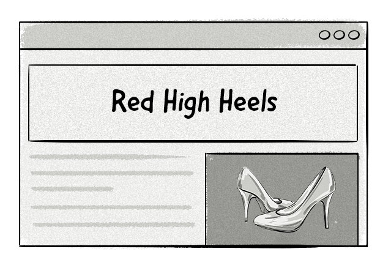
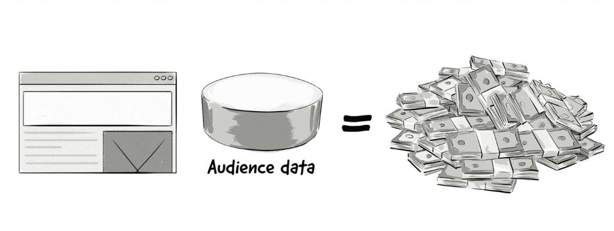
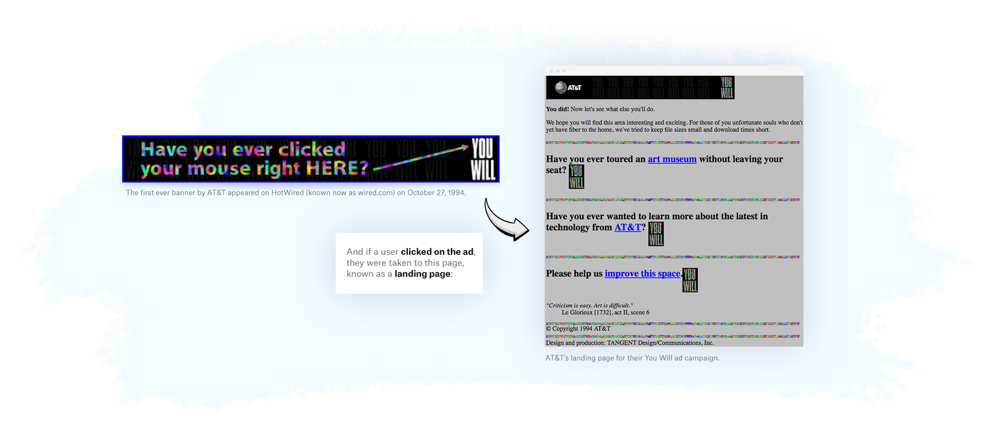

# Ad Tech Book

## Introduction (Completed)

## Advertising Basics

### Advertiser
* An advertiser is a brand or company (e.g. advertising agency) that wants to get its product or service in front of its target audience to build brand awareness, develop brand loyalty, and increase sales.

* Advertisers aren’t only big brands; millions of small- and medium-sized enterprises (SMEs) and organizations advertise their services and products online every day. 

Large brands, such as those listed above, are often represented by advertising agencies, whose job is to:
* Create campaign (designing graphical elements)
* Execute the campaign (targetting, frequency capping, target channels)
* Manage the campaign (Measuring and making changes to improve performance)

#### Why do Brands & Companies advertise?
* Brand awareness
* Direct response (buy, fill a form)(prospecting & acquisition)
* Retention

### Publisher
* A publisher can be defined as any company that produces content that attracts an audience.
* Newspapers, magazines, mobile app

#### How Do Publishers Monetize Their Websites and Apps?
* Digital Ads

* Paywalls and registration walls

* Products and Services
  
* Selling data

## The History of Digital Advertising Technology
* The year 1994 saw the first recorded example of online display advertising in the form of a banner ad, which appeared on a website called HotWired (now wired.com). It was purchased by telecommunications giant AT&T and used to promote its campaign titled You Will.
* Over its three-month life span, 44% of viewers clicked on the banner ad; compare that to today, where it’s estimated that online visitors click on about 0.02% to 2% of ads.

### Insertion order
* **Campaign objectives**: Target group, traffic, branding, etc.
* **Line items with campaign execution terms**: Which banner sizes to use, where to place the ads, and which pages to display the ads on.
* **Business terms**: The pricing model (CPM, CPC, etc.) and payment terms.

### Ad server
* Initially were used to control the delivery and management of online ads.
* Targetting was simple based on HTTP headers
  * The language set on the user’s computer
  * The URL of the page the ad is being loaded onto
  * The browser type and version
  * The user’s operating system
* Advertisers had to sign individual insertion orders with every publisher they wanted to work with and coordinate the campaign execution.

### Ad Networks

## Glossary
* **CTR - Click-through rate** (is the number of clicks an ad receives divided by the number of times it’s displayed. For example, if an ad had a CTR of 2%, then for every 1,000 impressions, it received 20 clicks.)
* **CPM - Cost per Mile** (Thousand impressions, mile is thousand in latin)
* **CPC - Cost per Click**
