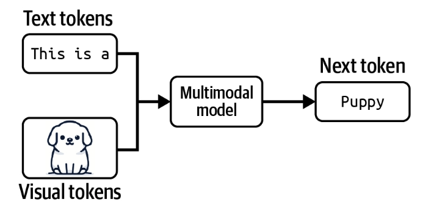

# AI Engineering
by [[Chip Huyen]]

## Highlights
> Evaluation is one of the hardest, if not the hardest, challenges of AI engineering.

> Our success depends on our ability to filter and digest useful information.

> It might take a weekend to build a demo but months, and even years, to build a product.

## Contents

## The Book in 3 Sentences

## Who Should Read It?

## My Top 3 Quotes

## Notes
* Lindy’s Law
* Given a query, the quality of a model’s response depends on the following aspects (outside of the model’s generation setting):
  * The instructions for how the model should behave.
  * The context the model can use to respond to the query.
  * The model itself.
### Introduction to Building AI Applications with Foundation Models
#### The Rise of AI Engineering
##### From Language Models to Large Language Models
* The process of breaking the original text into tokens is called tokenization.
* There are two main types of language models:
  * Masked language models
    * Masked language models are commonly used for non-generative tasks such as sentiment analysis and text classification. They are also useful for tasks requiring an understanding of the overall context, such as code debugging, where a model needs to understand both the preceding and following code to identify errors.
  * Autoregressive language models.

* The outputs of language models are open-ended. A language model can use its fixed, finite vocabulary to construct infinite possible outputs. A model that can generate open-ended outputs is called generative, hence the term generative AI.
* It’s important to note that completions are predictions, based on probabilities, and not guaranteed to be correct. This probabilistic nature of language models makes them both so exciting and frustrating to use.
* While completion is powerful, completion isn’t the same as engaging in a conversation.
* Language modeling is just one of many ML algorithms. There are also models for object detection, topic modeling, recommender systems, weather forecasting, stock price prediction, etc.
* The answer is that language models can be trained using self-supervision, while many other models require supervision. Supervision refers to the process of training ML algorithms using labeled data, which can be expensive and slow to obtain. Self-supervision helps overcome this data labeling bottleneck to create larger datasets for models to learn from, effectively allowing models to scale up.
* A drawback of supervision is that data labeling is expensive and time-consuming.
* Self-supervision differs from unsupervision. In self-supervised learning, labels are inferred from the input data. In unsupervised learning, you don’t need labels at all.

##### From Large Language Models to Foundation Models
* A model that can work with more than one data modality is also called a multimodal model.

* Foundation models also mark the transition from task-specific models to general-purpose models. Previously, models were often developed for specific tasks, such as sentiment analysis or translation. A model trained for sentiment analysis wouldn’t be able to do translation, and vice versa.
* Prompt engineering, RAG, and finetuning are three very common AI engineering techniques that you can use to adapt a model to your needs.

##### From Foundation Models to AI Engineering
* AI engineering refers to the process of building applications on top of foundation models.

#### Foundation Model Use Cases
* Internal applications help companies develop their AI engineering expertise while minimizing the risks associated with data privacy, compliance, and potential catastrophic failures.

* Classification tasks are easier to evaluate, which makes their risks easier to estimate.

##### Coding
* Extracting structured data from web pages and PDFs (AgentGPT) Converting English to code (DB-GPT, SQL Chat, PandasAI)

* Given a design or a screenshot, generating code that will render into a website that looks like the given image (screenshot-to-code, draw-a-ui) Translating from one programming language or framework to another (GPT-Migrate, AI Code Translator) Writing documentation (Autodoc) Creating tests (PentestGPT) Generating commit messages (AI Commits)

* In a leaked recording, AWS CEO Matt Garman shared that in the near future, most developers will stop coding.

* In my conversations with developers of AI coding tools, many told me that they’ve noticed that AI is much better at frontend development than backend development.

##### Image and Video Production
##### Writing
##### Education
##### Conversational Bots
##### Information Aggregation
* Many people believe that our success depends on our ability to filter and digest useful information. However, keeping up with emails, Slack messages, and news can sometimes be overwhelming. Luckily, AI came to the rescue. AI has proven to be capable of aggregating information and summarizing it.
##### Data Organization
##### Workflow Automation
* AIs that can plan and use tools are called agents.

#### Planning AI Applications
* Involving humans in AI’s decision-making processes is called human-in-the-loop.
* Crawl means human involvement is mandatory. Walk means AI can directly interact with internal employees. Run means increased automation, potentially including direct AI interactions with external users.
* If you’re selling AI applications as standalone products, it’s important to consider their defensibility. The low entry barrier is both a blessing and a curse. If something is easy for you to build, it’s also easy for your competitors. What moats do you have to defend your product?
* One general partner at a major VC firm told me that she’s seen many startups whose entire products could be a feature for Google Docs or Microsoft Office. If their products take off, what would stop Google or Microsoft from allocating three engineers to replicate these products in two weeks?
* In AI, there are generally three types of competitive advantages: technology, data, and distribution—the ability to bring your product in front of users. With foundation models, the core technologies of most companies will be similar. The distribution advantage likely belongs to big companies.
* The data advantage is more nuanced. Big companies likely have more existing data. However, if a startup can get to market first and gather sufficient usage data to continually improve their products, data will be their moat.
* Latency metrics including TTFT (time to first token), TPOT (time per output token), and total latency.
* You’ll have to constantly be on your guard and run a cost-benefit analysis of each technology investment. The best option today might turn into the worst option tomorrow. You may decide to build a model in-house because it seems cheaper than paying for model providers, only to find out after three months that model providers have dropped their prices in half, making in-house the expensive option. You might invest in a third-party solution and tailor your infrastructure around it, only for the provider to go out of business after failing to secure funding.
* Some changes can even be fatal. For example, regulations around intellectual property (IP) and AI usage are still evolving. If you build your product on top of a model trained using other people’s data, can you be certain that your product’s IP will always belong to you? Many IP-heavy companies I’ve talked to, such as game studios, hesitate to use AI for fear of losing their IPs later on.

#### The AI Engineering Stack
* There are three layers to any AI application stack:
  * application development,
  * model development,
  * infrastructure.
* Without foundation models, you have to train your own models for your applications. With AI engineering, you use a model someone else has trained for you. This means that AI engineering focuses less on modeling and training, and more on model adaptation.
* AI engineering works with models that are bigger, consume more compute resources, and incur higher latency than traditional ML engineering.
* AI engineering works with models that can produce open-ended outputs. Open-ended outputs give models the flexibility to be used for more tasks, but they are also harder to evaluate. This makes evaluation a much bigger problem in AI engineering.
* In short, AI engineering differs from ML engineering in that it’s less about model development and more about adapting and evaluating models.
* Prompt-based techniques, which include prompt engineering, adapt a model without updating the model weights.
* You adapt a model by giving it instructions and context instead of changing the model itself. Prompt engineering is easier to get started and requires less data. Many successful applications have been built with just prompt engineering. Its ease of use allows you to experiment with more models, which increases your chance of finding a model that is unexpectedly good for your applications. However, prompt engineering might not be enough for complex tasks or applications with strict performance requirements.
* Finetuning, on the other hand, requires updating model weights. You adapt a model by making changes to the model itself. In general, finetuning techniques are more complicated and require more data, but they can improve your model’s quality, latency, and cost significantly. Many things aren’t possible without changing model weights, such as adapting the model to a new task it wasn’t exposed to during training.

### Understanding Foundation Models

## Bibliography
